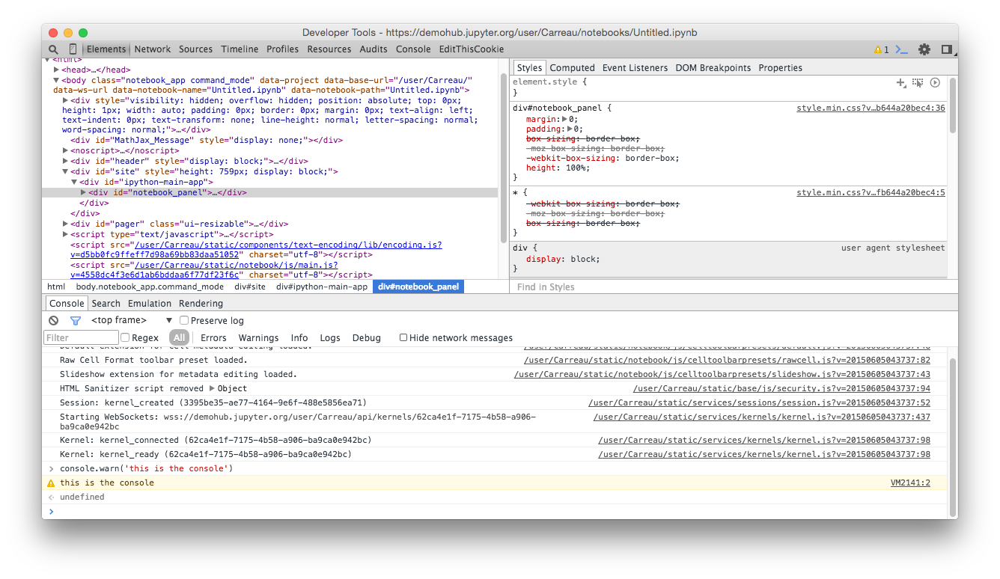

# The Things of the Web

Hello reader, welcome to the beautiful world of Jupyter Notebook.
One of the reason Jupyter Notebook is so awesome is that it leverages technologies from the web. This allow you to do a large number of things for free, like video, and audio in the Browser.

If you want to hack and understand how the notebook works to fully appreciate its potential, you have to get familiar with a few web technologies.

This chapter is here to give you the necessary basics on web technologies. We will also introduce the core tools you want to use when hacking on the web.


## The web browser

One of the key tool you use all the time when working on the web your web browser. I'm sure you use your browser everyday, but your browser can be your best ally or worst enemy. The number of functionalities that your browser have and can do is pretty large. Describing all the things can take days, so we will focus on the basics. I encourage you to learn more about what your browser can you by yourself.


### Browser Choice

As a browser of choice I will use Chrome. Chrome comes by default with a lot of baked in tools, so you will not need to install any extensions. The interface will be also consistent regardless of the Os you are using.

If you are more a fan of Firefox, you may want to install the developer edition. It comes preconfigured with many defaults. The developer tools in the standard edition will get you a long way, however.

The other major browser are Safari on MacOS, and Internet Explorer for Windows. Unfortunately, I am not familiar with either of them.
As far as I know you can make most of what we will do in Safari. You might just have to enable developer mode in the advance preferences.

## Developer tools.

The developer tools are a number of panels that allow you to interact with the web page in a way much different than usual browsing. You can sort of see that as a powerful debugger that allow you to modify and inspect the running page live.

To open the developer tools, in **Chrome**, go to the `View > Developer > Developer Tools`. In Firefox, go to the menu, `Developer > Toggle Tools`.
I suggest you learn the keyboard shortcut to open the Dev Tools. It's probably one of the shortcuts you will use the most in this tutorial.




Ok, so let's look at different areas of the developer tool you will be interested in.

#### DOM Tree

The far left tab, named `Elements` or `Inspector` is the tab that allow you to view the current structure of the 'Document Object Model', or DOM.
We won't really get into the DOM much. As a first approximation, the DOM is the current state of the HTML. You want use this tab if you are trying to inspect or modify the structure of the DOM.

One of the useful things is the small magnifying glass just to the left of the `Elements`.
It allow you to click on a visual element in a page, and get it selected on the tree view.

Let's try to mess a bit with the DOM. In the tree view on the upper left, try to double click and edit some element of the DOM. You will see that when you hover the tree, the relevant part of the view is highlighted. Try to figure out where the cell, the pager, and toolbar are in a notebook page.

### CSS inspector.

On the right of the DOM Tree view is the CSS inspector. This lets you observe and modify the CSS rules that apply to the current selected element. It is these rules that describe the layout and appearance of the notebook page.

### Javascript console

The last part of the Devtools that we will use today is the Javascript console.
It's like IPython or any other REPL, but it runs Javascript in the context of the page.

It's also different from usual REPLs in that the javascript on the page is continually executing, and does not pause when you're prompted for input.

Let's try the basic of the console.

```javascript
> console.log('Hello Jupyter Notebook')
```

You can also run a task in the background.

```javascript
> setInterval(function(){console.log('hi there')}, 3000)
```

This will print every 3 seconds. When it annoys you enough, refresh your page, all your changes will be gone.

Let's try something more visual:

```javascript
> $('.cell:even').slideUp('slow').slideDown('slow')
```

We won't get into details, but you did something equivalent to numpy broadcasting. You applied a function to a collection of elements of the DOM.


## Browser lies

There's an old programmer joke that there are only two hard problems with computers: naming things, cache invalidation, and off by one errors. Unfortunately, we have to deal with all of these in developing for the web. There are a few extension that allow you to flush cache and reload the page at the same time. But one of the easy options is to deactivate Browser caching when your developer tools are open.

To do so with your dev tools open, click on the setting menu (gear icon on the top right) and disable caching when you are developing.

This will most likely prevent you from madness, as it is easy to assume when you reload the page that you get the last version of the javascript you just saved.

Keep in mind that opening the developer tools might slow down your browser. You might not see it, or feel it. Though it might have effect in case of timing bugs, and race condition (also know as Heisenbugs, after the quantum physicist). Opening the developer tools may make some bugs disappear.

By quantum physicist, I of course mean people who are a superposition of Physicist and non-Physicist until you observe them.

One last tricky-bit is that `$`, `_`, and a few other function/methods might not be and behave the same in console and in scripts. We'll see what these are in next chapter.


## Conclusion

Well you get the basics for the tools. There is much more to say, but you should have enough knowledge to mess around. The goal here is to give you enough to get started. Next step is to introduce not the tool themselves but some common utilities, and non-written things that are common knowlege among web developers.
